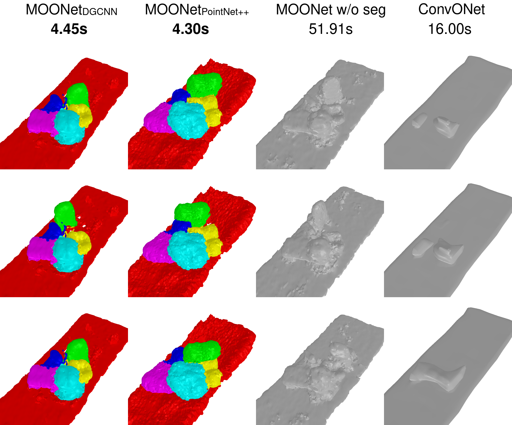

# MOONet :cow: : Multi-Object Occupancy Networks



Repository for the 2023 ADL4CV project __"Multi-Object Occupancy Networks"__ by Gianluca Galletti and Nina Kirakosyan.

__Abstract:__ Reliably reconstructing full 3D scenes from sparse representations, such as point clouds, has been a very active topic in the recent years. Learnable 3D implicit functions are a popular class of models that has been shown to be very successful when applied on this task. Although the promising results, the current state of the art still considers the entire scene as one object, and discards any semantic information coming from the objects placed in the scene. 
We propose Multi-Object Occupancy Networks (MOONets in short), which are a novel set of implicit functions that explicitly make use of object segmentation, by encoding, decoding and reconstructing each object in the scene separately. This has the double advantage of leveraging semantic information from instance segmentation, and inducing perfect robustness towards object transformations.
We achieve results comparable to the state of the art on the synthetic rooms dataset, and while not improving on previous results, our method enables reliable scene reconstruction with moved objects, with a single forward pass and without any loss of performance.

---

## Installation
### Clone the repository
```bash
git clone github.com/gerkone/multiobject-onet
cd multiobject-onet
```
Build Cython modules (`MISE`, `libmesh`, `libsimplify` and `libvoxelize`)
```bash
python setup.py build_ext --inplace
```

Install python requirements
```bash
pip install -r requirements.txt
```

## Dataset
The __semantic synthetic room dataset__ (ssrd) is a modified version of the synthetic room dataset from Occupancy Networks.
For scene-level reconstruction, we create a synthetic dataset with multiple objects from ShapeNet (chair, sofa, lamp, cabinet, table). There are also ground planes.

### Download the original dataset
You can download the preprocessed ShapeNet data (80GB) using

```
bash scripts/get_shapenet.sh
```

This script should download and unpack the data automatically into `data/synthetic_room_dataset`.  

### Process synthetic_room_dataset
Extract watertight meshes with 
```
python scripts/binvox_to_off.py --inputs=<ShapeNet directory path> --outputs=<watertight directory path>
```

### Generate synthetic rooms
You can now generate the rooms with both semantic and instance labels with
```
python scripts/build_synthetic_scene.py --input=<ShapeNet directory path> --input-watertight=<watertight directory path> --output=<synthetic rooms output path>
```

## Usage
- `train.py` can be used to train or evaluate a model.
- `mogen.py` can be used to generate animations of the multi-object generation in action.

For example, to train from scratch MOONet with DGCNN as encoder, run
```bash
python train.py --model configs/ssrd/moonet_dgcnn.yaml --data-path=<ssrd path> --new
```

## Acknowledgements
Our project is based on the [occupancy network repo](github.com/autonomousvision/occupancy_networks). 

We also thank [Yunlu Chen](https://yunlu-chen.github.io/) for giving us access to the code for his paper [3D Equivariant Graph Implicit Functions](https://staff.fnwi.uva.nl/y.chen3/3DEGIF/paper.pdf).